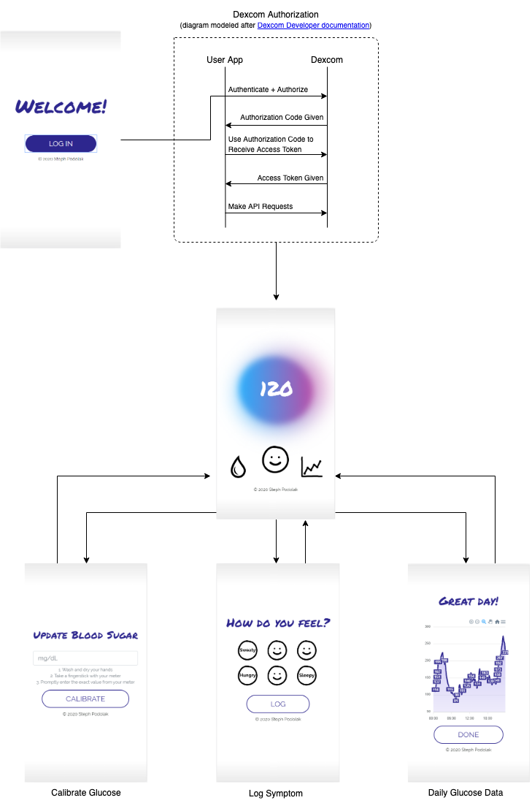
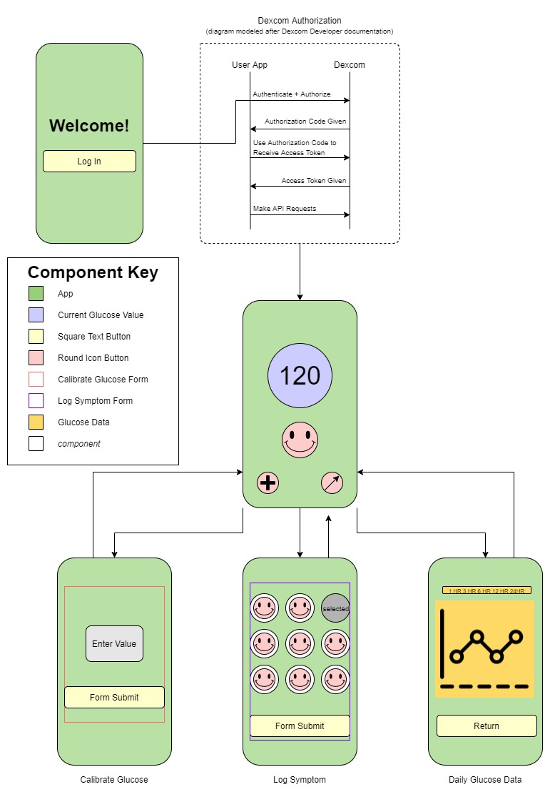

# Continuous Glucose Monitoring with [Dexcom](https://www.dexcom.com/)

#### Your child's diabetic mood ring.

The application displays the user's current blood sugar values and teaches the user body awareness by prompting them to log physical symptoms during critical blood sugar changes.  The user should be wearing a [Dexcom Continuous Glucose Monitor [CGM]](https://www.dexcom.com/g6/how-it-works). 

[CLICK HERE TO PREVIEW USER INTERFACE](https://spodolak.github.io/DexcomCGM/) 

#### By Steph Podolak

## User Stories

* As a child with type 1 diabetes, I want to develop body awareness so I can identify signs of adverse blood sugar changes and be empowered to manage my own blood sugar levels. 
  - I need a simple and motivating way of identifying and tracking my daily feelings and symptoms.
  - I need to be reminded to check in with my body during glucose highs, lows, when I wake up in the morning, when I eat, 2 hours after I eat.
* As a parent, I want to actively participate in my child’s diabetic experience so I can better validate and motivate their blood sugar management.
* As a physician, I want to collect realtime patient symptom data that correlates with blood sugar values. This will allow me to make psychosocially informed treatment plans that increase patient compliance.

## Current Prototype


## Component Tree



## Technologies Used

* React
* Node.js
* Webpack
* npm
* Javascript
* jQuery
* React-Bootstrap
* Google Fonts

## Demo application with Dexcom Sandbox data with npm
# 1. Register as a developer with Dexcom
In order to gain access to Dexcom API sandbox data, you must first [register as a dexcom developer](https://developer.dexcom.com/user/register) and log in to your account.   

Next, create an App by navigating to your username in the top right corner of your account page, click on the drop down menu and select 'My Apps'.

# 2. Clone this repository

Enter the following commands in Terminal (macOS) or PowerShell (Windows):
```sh
cd desktop
git clone https://github.com/spodolak/DexcomCGM
cd Dexcom CGM
```
# 3. Install all necessary packages and make sure the project will build
In your terminal, type the following commands to make sure all necessary packages are included in the project and to launch in your browser:
```sh
npm install
```

# 5. Launch the project in your browser
In your terminal, type:
```sh
npm run start
```
Hold ```command``` while clicking the link in your local terminal to your local address, which should be:
```sh
http://localhost:3000
```


This project was bootstrapped with [Create React App](https://github.com/facebook/create-react-app).

## Available Scripts

In the project directory, you can run:

### `npm start`

Runs the app in the development mode.<br />
Open [http://localhost:3000](http://localhost:3000) to view it in the browser.

The page will reload if you make edits.<br />
You will also see any lint errors in the console.

### `npm run build`

Builds the app for production to the `build` folder.<br />
It correctly bundles React in production mode and optimizes the build for the best performance.

The build is minified and the filenames include the hashes.<br />
Your app is ready to be deployed!

See the section about [deployment](https://facebook.github.io/create-react-app/docs/deployment) for more information.

### License

$copy 2020 - Stephanie Podolak.
Under exclusive copyright. All rights reserved.
